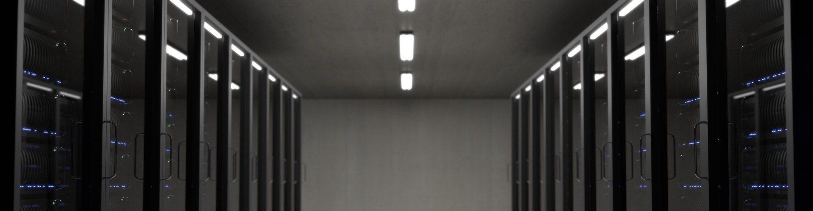

import ProjectSlider from "~/components/ProjectSlider.astro";

# Digitalisierung

Der Übergang von der analogen in die digitale Welt ist das vorherrschende Thema in allen Arbeitsbereichen. Von der Aufrüstung des Telekommunikationsnetzes hin zum Glasfaser-Standard, 5G Mobilfunk, über Cloud-Office und Remote Work: Die digitale Transformation ist in vollem Gange.

Aufgrund der rasanten Entwicklung ist es nicht immer einfach, den Überblick zu behalten. Wir helfen Ihnen! Wir beraten und unterstützen mittelständische Unternehmen, Behörden und Schulen bei der Installation, Migration und Wartung sowohl von lokalen Server-Netzwerken als auch Cloud-Infrastrukturen. Selbstverständlich erfolgt dies unter Berücksichtigung aktuell geltender Datenschutzbestimmungen (DSGVO).

Dabei profitieren wir davon, dass wir diese digitale Transformation schon früh im eigenen Hause angestoßen haben und nun vollständig im Cloud-Office arbeiten.

Nun beraten wir Andere bei dieser digitalen Transformation!

<ProjectSlider path="digitalisierung/" />

---

Haben Sie Fragen zu unseren Leistungen im Bereich Digitalisierung oder suchen Sie Hilfe?

Melden Sie sich per [E-Mail](mailto:info@lehne-ing.de) oder einfach über unseren Kontaktbereich.
