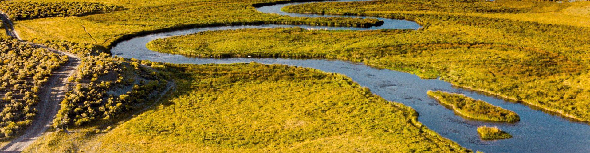

import ProjectSlider from "~/components/ProjectSlider.astro";

# Environment

Our engineering services in the environment and engineering field
include the development of sustainable technological processes for the
purpose of protecting the environment and restoration of damaged
ecological systems. Disposal issues such as waste disposal, waste
incineration, recycling and waste water purification in addition to
technical measures for waterways, soils, noise and radiation protection
are included in this field in the metropolitan city of Hamburg.
Furthermore, we are committed to effective usage of energy as a result
of our construction measures.

<ProjectSlider path="en/environment" />

---

You got any questions to our work area environment or you are looking for help?

Get in touch with us via [mail](mailto:info@lehne-ing.de) or via our contact area.
