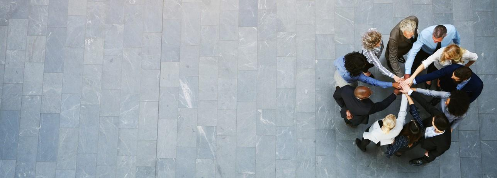
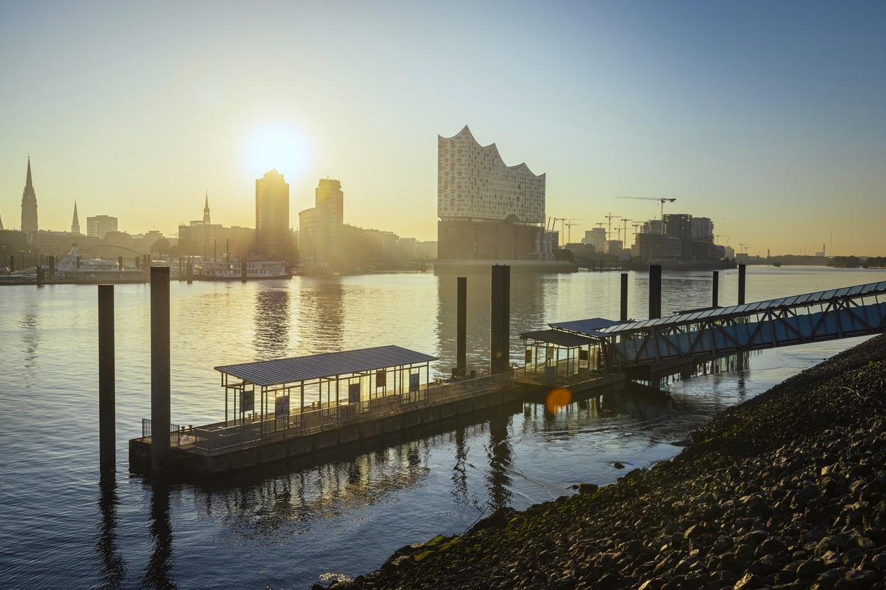

import { Icon } from "astro-icon";

# Expert-Network

Through active participation in various professional associations, we
constantly exchange knowledge within our expert network, which enables
us to ensure a comprehensive portfolio of current knowledge and
experiences.

---

## Current projects

Our engineers develop building constructures and infrastructure that
improve people’s lives and enable planning mobility, climate protection
and energy security.

You can find the current campaign of the VBI – „Die Ausdenker (the thinker)“ here:

[Die Ausdenker – Verband Beraten der Ingenieure (vbi.de)](https://www.vbi.de/die-ausdenker/) – The website is in German.

---

## VBI – Verband Beratender Ingenieure state association Hamburg

Since the end of 2022, Dipl.-Ing. Stefan Paul has been the chairman
of the VBI state association in Hamburg. The focus of the association’s
work is on promoting young talent through contact with young people,
training and further education of its members, and advising state
politics on the design of laws and regulations. Through the
association’s function as a communication platform, VBI Hamburg enables
professional exchange between experts from various disciplines and
informs society about important issues through active press work.

<a
  href="https://www.instagram.com/verband_beratender_ingenieure/"
  target="_blank"
  class="flex w-fit mx-auto"
>
  <Icon name="mdi:instagram" class="w-10vmin h-10vmin text-primary" />
</a>

---

## Memberships of LEHNE ing. or management

- Since 2022, chair of the state association in the association of consulting engineers (VBI)
- Since 2008 member of the VBI – Verband der Beratenden Ingenieure (association of consulting engineers)
- Since 2008 member of the HK – Handelskammer für die Freie und
  Hansestadt Hamburger (chamber of commerce for the free and Hanseatic
  city of Hamburg)
- Since 2005 member of the VflS – Verband freier Ingenieure für
  Straßenbau in Hamburg e.V. (association of independent engineers for
  road construction in Hamburg)
- Since 2000 member of the DWA – Deutsche Vereinigung für
  Wasserwirtschaft, Abwasser und Abfall e.V. (german association for
  water, wastewater, and waste)
- Since 1999 member of the HIKB – Hamburgische Ingenieurkammer-Bau (Hamburg Chamber of engineers)
- Since 1998 member of the VSVI – Vereinigung der Straßenbau- und
  Verkehrsingenieure Hamburg e.V. (association of road and traffic
  engineers Hamburg)
- Since 1998 member of the BWK – Die Umweltingeneure, Landesverband
  Hamburg e.V. (environmental engineer, regional association Hamburg)

