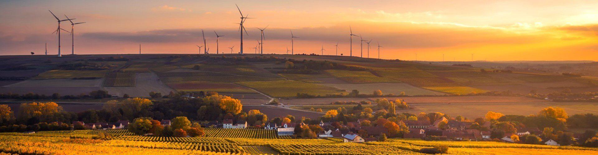

---

# Sustainability

Sustainability is a principle of ressource usage, that aims at
assuring the natural regenarative ability of involved systems. In our
urban environment numerous of those systems – the atmosphere, the water
cycle or the soil – are stressed and should be preserved in order to be
available for future generations. To achieve that goal, many aspects of
human activity must be re-evaluated and potentially revolutionized.

One sector, that has always been very invasive and resource-intense,
is the building industry. Humans transform their environment according
to their ideas and needs. To ensure that this environment remains
liveable and worth living for coming generations, the concept of
sustainability has become a major focus.

## Sustainable infrastructure

The idea of sustainability can be applied in all branches of the
building industry – from structural engineering to civil engineering.
Sustainable infrastructure has the biggest role as water, energy and
transportation are source and engine for further sustainable
development.

Water
is food, base for hygiene, asset and production factor. Access to this
vital resource and sanitation provision is a requirement for health,
peaceful coexistence and productivity.

A dynamic development needs energy,
that is environmentally sustainable and available where needed – in
private households, in agriculture, in industrial production as well as
the service sector.

An efficient and sustainable transportation
system is the backbone of modern economy. It enables the commute to
work, the way to education and health institutions as well as the
connection to rural areas and makes cities internationally competitive.

The idea of sustainability can be applied in all branches of the
building industry – from structural engineering to civil engineering.
Sustainable infrastructure has the biggest role as water, energy and
transportation are source and engine for further sustainable
development.

Water
is food, base for hygiene, asset and production factor. Access to this
vital resource and sanitation provision is a requirement for health,
peaceful coexistence and productivity.

A dynamic development needs energy,
that is environmentally sustainable and available where needed – in
private households, in agriculture, in industrial production as well as
the service sector.

An efficient and sustainable transportation
system is the backbone of modern economy. It enables the commute to
work, the way to education and health institutions as well as the
connection to rural areas and makes cities internationally competitive.

## Goals for sustainable building

## Our contribution at LEHNE ing.

In corporation with our clients we work hard to connect economic
success with social responsibility and the protection of the
environment. In doing so it is our aspiration to set a good example.
LEHNE ing. supports the [17 goals of sustainable development](https://sdgs.un.org/goals) of the United Nations. At all our commercial activities we aim to reduce negative impacts on our environment.

→ use resources optimally

→ working climate-friendly

→ human in the focus
