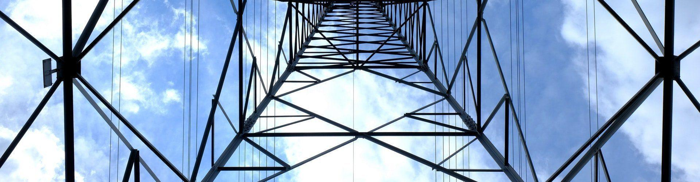

import ProjectSlider from "~/components/ProjectSlider.astro";

# Infrastruktur

Eine leistungsfähige Infrastruktur bildet den Grundstein unserer Gesellschaft. Sie umfasst die Wasser-, Energie- und Wärmeversorgung, Telekommunikation sowie nachhaltige Umwelt- und Abwassertechnik. Im Zuge der Modernisierung werden diese Teilsysteme immer mehr vernetzt und die technisch verbessert. Dies bringt erhebliche Vorteile in der Überwachung dieser Systeme aber geht auch mit erheblich steigender Komplexität in der Planung einher.

LEHNE ing. verfügt über langjährige Erfahrung in der Begleitung von Projekten aus allen Teilbereichen der städtischen Infrastruktur. Wir begleiten unsere Kunden mit stets aktuellem Fachwissen bei der Planung und Umsetzung von Infrastrukturprojekten.

<ProjectSlider path="infrastruktur/" />

---

Haben Sie Fragen zum Bereich Infrastruktur oder suchen Sie Hilfe?

Melden Sie sich per [E-Mail](mailto:info@lehne-ing.de) oder einfach über unseren Kontaktbereich.
