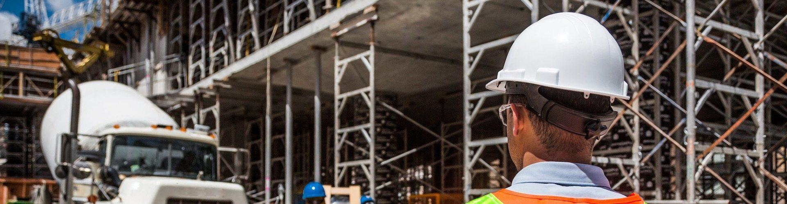

import ProjectSlider from "~/components/ProjectSlider.astro";

# Sicherheit und Gesundheitsschutz

Die Sicherheit und Gesundheit der Beteiligten sind bei der Umsetzung der Bauprojekte stets von höchster Priorität. LEHNE ing. verfügt über die notwendige Expertise und erstellt bei einer Vielzahl der Bauvorhaben die notwendigen Sicherheits- und Gesundheitsschutzpläne (SiGe). Bei der Koordination der Bauausführung wird die Einhaltung von Sicherheits- und Gesundheitsmaßnahmen stets überwacht.

<ProjectSlider path="sicherheit-gesundheitsschutz/" />

---

Haben Sie Fragen zum Bereich Sicherheit und Gesundheitsschutz oder suchen Sie Hilfe?

Melden Sie sich per [E-Mail](mailto:info@lehne-ing.de) oder einfach über unseren Kontaktbereich.
