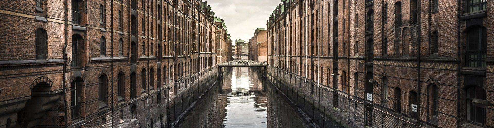

# Wasser

In Hamburg hat Wasser eine besondere
Bedeutung: Die geographische Lage an der Elbe mit dem Hafen, die
Wechselwirkungen der Gezeiten an der Küste, das umliegende Marschland
und die weiteren Wasserwege der Stadt machen Hamburg aus. Deshalb
gehören technische Eingriffe und Bauten im Bereich des Grundwassers, der
Oberflächengewässers und der Küstenregion zu unserem Expertenwissen.
Die Kernkompetenzen sind hierbei der Hochwasserschutz, erweitert in Form
von Strom- und Binnendeichen, sowie der Rückbau von Altdeichen.

Darüber hinaus planen wir den Ausbau von
Gewässern, naturnah oder mit Uferwänden, sowie den Neu- und Ausbau von
Regenrückhaltebecken, Retentionsräumen, Versickerungsanlagen und
Durchlassbauwerken. In der Umsetzung von wasserrechtlichen Genehmigungs-
und Planfeststellungsverfahren sind wir genauso erfolgreich.

---

Haben Sie Fragen zum Bereich Wasser oder suchen Sie Hilfe?
Melden Sie sich per [E-Mail](mailto:info@lehne-ing.de) oder einfach über unseren Kontaktbereich.
